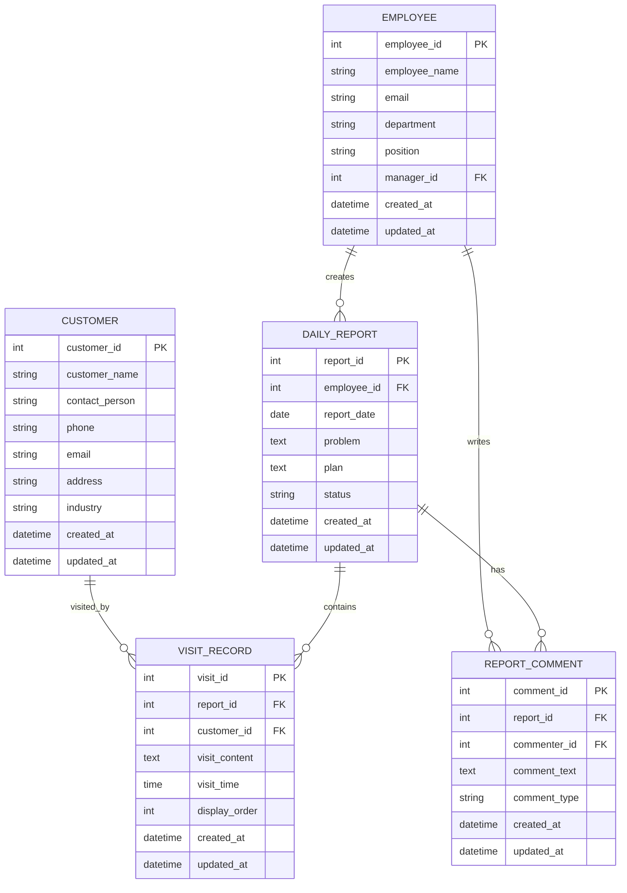

# CLAUDE.md

This file provides guidance to Claude Code (claude.ai/code) when working with code in this repository.

## Project Overview

営業日報システム (Sales Daily Report System) - A web-based system for sales representatives to submit daily reports and managers to review and comment on them.

## Core Requirements

### Key Features

1. **Daily Report Submission**: Sales reps create one daily report per day containing:
   - Multiple visit records (customer visits with details)
   - Problem: Current issues/concerns
   - Plan: Tomorrow's action items

2. **Visit Records**: Multiple visit entries per daily report, each containing:
   - Customer (from customer master)
   - Visit content/details
   - Visit time (optional)

3. **Manager Comments**: Managers can add comments to Problem/Plan sections

4. **Master Data**:
   - Customer Master (顧客マスタ)
   - Employee Master (営業マスタ) with manager hierarchy

### User Roles

- **Sales Representative**: Create reports and visit records
- **Manager**: View reports and add comments

## Requirements Definition

### 1. System Overview

A web-based system for sales representatives to submit daily reports and managers to review and comment on them.

### 2. Main Features

#### 2.1 Daily Report Management

- **Daily Report Creation**
  - Sales representatives create one report per day
  - Each report includes: date, creator (sales rep)
  - Problem (today's issues/concerns)
  - Plan (tomorrow's action items)

#### 2.2 Visit Records

- **Visit Information Registration**
  - Multiple visit records can be added to one daily report
  - Each visit record includes:
    - Visited customer (selected from customer master)
    - Visit content/details
    - Visit time (optional)

#### 2.3 Comment Feature

- **Manager Comments**
  - Managers can add comments to Problem/Plan sections
  - Comment timestamp is recorded

#### 2.4 Master Data Management

- **Customer Master**
  - Manages customer ID, name, contact info, address, etc.

- **Employee Master (Sales Master)**
  - Manages employee ID, name, department, position, etc.
  - Includes manager information

### 3. User Roles

- **Sales Representative**: Create daily reports, register visit records
- **Manager**: View reports, add comments

### 4. Non-functional Requirements (Expected)

- Web-based system
- Authentication and authorization
- Data backup
- Responsive design (mobile support)

## ER Diagram



### Table Descriptions

1. **EMPLOYEE (Employee/Sales Master)**
   - Manages sales representatives and managers
   - `manager_id`: Self-referencing foreign key to specify manager

2. **CUSTOMER (Customer Master)**
   - Manages basic customer information

3. **DAILY_REPORT (Daily Report)**
   - One report per day
   - `problem`: Today's issues/concerns
   - `plan`: Tomorrow's action items
   - `status`: Draft/Submitted/Reviewed status

4. **VISIT_RECORD (Visit Record)**
   - Multiple records per daily report
   - `display_order`: Manages display sequence

5. **REPORT_COMMENT (Report Comment)**
   - Comments added by managers to reports
   - `comment_type`: Distinguishes between Problem/Plan/General comments

## Database Schema

The system uses the following main entities (see ER diagram in requirements):

- **EMPLOYEE**: Stores sales reps and managers with self-referencing manager_id
- **CUSTOMER**: Customer master data
- **DAILY_REPORT**: One per day per employee (report_date, problem, plan)
- **VISIT_RECORD**: Multiple visits per report (customer_id, visit_content, display_order)
- **REPORT_COMMENT**: Manager comments on reports (comment_type for Problem/Plan/General)

Key relationships:

- One employee creates many daily reports
- One daily report contains many visit records
- One daily report can have many comments
- Employee.manager_id self-references for hierarchy

## Architecture Considerations

### Data Model Notes

- `DAILY_REPORT.report_date` + `employee_id` should be unique (one report per day per employee)
- `VISIT_RECORD.display_order` maintains the sequence of visits within a report
- `REPORT_COMMENT.comment_type` distinguishes between Problem/Plan/General comments
- `EMPLOYEE.manager_id` enables the approval workflow hierarchy

### Status Management

- Daily reports should track status: draft → submitted → reviewed
- Consider soft deletes for audit trail

### Future Considerations

- Authentication and authorization (role-based access)
- Search and filtering by date range, employee, customer
- Analytics: visit frequency, customer engagement metrics
- File attachments for visit records
- Notification system for report submissions and comments

## Development Setup

### Code Quality Tools

**ESLint**: Code linting for TypeScript/JavaScript

- Config: `.eslintrc.json`
- Run: `npm run lint`
- Auto-fix: `npm run lint:fix`

**Prettier**: Code formatting

- Config: `.prettierrc.json`
- Run: `npm run format`
- Check: `npm run format:check`

**TypeScript**: Type checking

- Config: `tsconfig.json`
- Run: `npm run type-check`

### Common Commands

```bash
# Install dependencies
npm install

# Development
npm run dev           # Start development server

# Linting
npm run lint          # Check code quality
npm run lint:fix      # Auto-fix issues

# Formatting
npm run format        # Format all files
npm run format:check  # Check formatting

# Type checking
npm run type-check    # TypeScript type check

# Testing
npm run test          # Run tests in watch mode
npm run test:run      # Run tests once
npm run test:ui       # Run tests with UI
npm run test:coverage # Generate coverage report

# Build
npm run build         # Build for production
npm start             # Start production server
```

### Testing Setup

**Vitest**: Fast unit test framework

- Config: `vitest.config.ts`
- Setup: `vitest.setup.ts`
- Coverage threshold: 80%

**Testing Libraries**:

- `@testing-library/react` - React component testing
- `@testing-library/jest-dom` - Custom matchers
- `@testing-library/user-event` - User interaction simulation

**Test File Naming**:

- `*.test.ts` or `*.test.tsx` - Unit tests
- `*.spec.ts` or `*.spec.tsx` - Integration/E2E tests
- Place tests in `__tests__/` directory or co-locate with source files

## Related Documentation

- [Screen Design](SCREEN_DESIGN.md) - 画面定義書
- [API Specification](API_SPECIFICATION.md) - API仕様書
- [Test Specification](TEST_SPECIFICATION.md) - テスト仕様書

# 使用技術

**言語:** TypeScript
**フレームワーク** Next.js(App Router)
**UIコンポーネント** shadcn/ui + Tailwind CSS
**APIスキーマ定義** OpenAPI(Zodによる検証)
**DBスキーマ定義** Prisma.js
**テスト** Vitest
**デプロイ** Google Cloud Run
